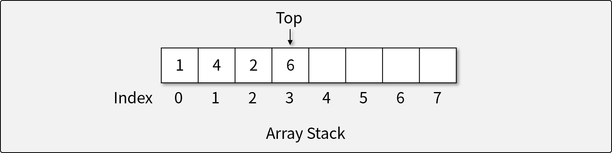

# 스택

## 스택이란

- 스택은 후입선출(Last In First Out; LIFO)의 특성을 가지는 **추상 자료형**이다.
- 자료가 입력된 순서의 역순으로 처리되어야 할 때 사용한다.
    - ex) 프로토타입 체인, 함수 콜 스택, OS 등

## 스택의 연산자

1. 자료를 Top 위에 삽입하는 연산자 (Push)
    - 더 이상 삽입할 수 없는 경우 *오버플로우* 발생
1. 자료를 Top에서 꺼내는 연산자 (Pop)
    - 더 이상 꺼낼 수 없는 경우 *언더플로우* 발생
1. Top에 있는 자료를 반환하지만, 삭제하지는 않는 연산자 (Peek)
1. 스택이 비어있는지 확인하는 연산자 (Empty)

## 스택의 구현

- 배열을 이용하여 구현한 스택
    - 배열을 사용하므로, 크기가 정해져 있다.
    - 메모리 상에서 연속으로 존재하기 떄문에 동작 속도가 빠르다.

TODO: 스택을 자바에서 사용하는 방법

TODO: 스택 문제 2~3개
