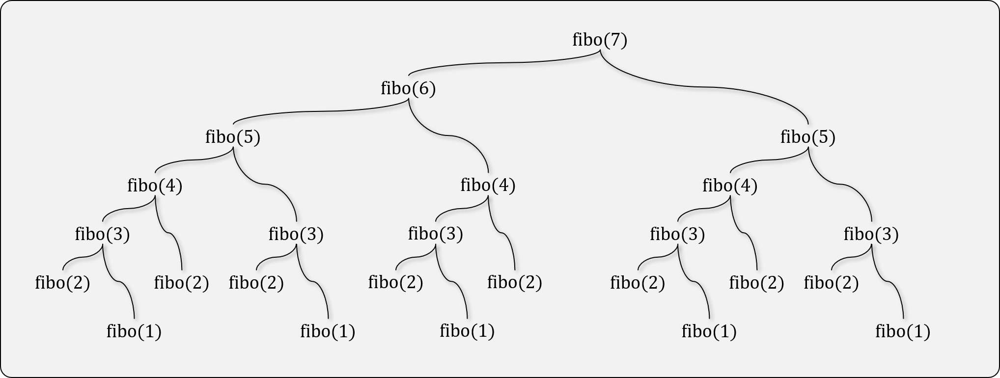

# 재귀 호출

## 재귀 호출이란

- 함수가 자기 자신을 호출하는 것을 재귀 호출이라 한다.
- 분할 정복(Divide & Conquer), 점화식 등을 구현하는 데에 많이 사용된다.
- 재귀 구현은 항상 반복(Iteration) 구현으로 변환될 수 있다.

## 점화식

- 재귀식(Recursion relation)이라고도 부르며, 수열의 항 사이의 관계를 나타낸다.
- 일부 점화식은 일반식으로 풀이할 수 있다. 수열을 n에 대한 식으로 표현하는 것을 '풀이한다'고 한다.
- 점화식의 예
    - 피보나치 수열: `f(n) = f(n-1) + f(n-2)`
    - 팩토리얼: `f(n) = n * f(n-1)`
    - 등차 수열: `f(n) - f(n-1) = d`
    - 등비 수열: `f(n) / f(n-1) = r`

## 재귀 호출

- 재귀 호출을 할 때에는 반드시 '탈출 조건'이 필요하다.
    - 탈출 조건이 없으면, 재귀 호출은 무한히 계속된다.
- 점화식에 의거하여 재귀 호출을 수행한다.
    - 입력 파라미터를 달리하여, 결국 탈출 조건에 도달할 수 있게 한다.

``` java title="Fibonacci using recursion" 
int fibonacci(n):
    if (n < 2): // 탈출 조건
        return 1
    return fibonacci(n-1) + fibonacci(n-2) // 재귀 호출(점화식 구현)
```

## 재귀 호출의 한계



- 여러번 재귀 호출이 발생하는 경우, 기하급수적으로 호출 횟수가 증가한다.
    - 함수 호출 스택(Function call stack)의 크기에 제한이 있어, 일정 횟수 이상 호출이 불가하다.
- 실질적인 계산에 필요한 연산보다, 함수 호출에 의한 Overhead가 발생한다.

## 재귀 함수의 반복 구현

- 대부분의 재귀 함수는 for문이나 while문으로 구현할 수 있다.
- 탈출 조건 대신 초기값을 이용하여 Bottom-Up 형태로 구현한다.

    ``` java title="Fibonacci using iteration"
    int fibonacci_iter(n) {
        int a = 1, b = 1; // 초기값
        for (int i = 3; i < n; i++) {
            int temp = a;
            a = a + b; // a는 fibo(i)를 기억
            b = temp;  // b는 fibo(i-1)를 기억
        }
        return a;
    }
    ```


## 스택과 재귀 함수

- 스택을 이용하면 재귀 호출과 동일한 로직을 재귀 호출 없이 구현할 수 있다.


    ``` java title="Fibonacci using a stack"
    int fibonacci_stack(n) {
        int result = 0;
        
        Deque<Integer> stack = new ArrayDeque<>();
        stack.push(n);
        
        while (!stack.isEmpty()) {
            int value = stack.pop();

            if (value == 0 || value == 1) {
                result += 1;
            } else {
                stack.push(value - 1);
                stack.push(value - 2);
            }
        }

        return result;
    }
    ```

    !!! note

        재귀 호출을 이용한 구현에 비해서 가독성도 떨어지고, 작성 시간도 오래 걸리기 떄문에 성능 이슈가 있을 때만 특별히 사용한다.


## 재귀 문제 풀이

- [프로그래머스 하노이의 탑](https://programmers.co.kr/learn/courses/30/lessons/12946){:target="_blank"} ([답안 코드](https://github.com/abel-shin/pccp-java/blob/main/src/day3/Solution5.java){:target="_blank"})
- [카카오 괄호 변환 문제](https://programmers.co.kr/learn/courses/30/lessons/60058){:target="_blank"} ([답안 코드](https://github.com/abel-shin/pccp-java/blob/main/src/day3/Solution6.java){:target="_blank"})
